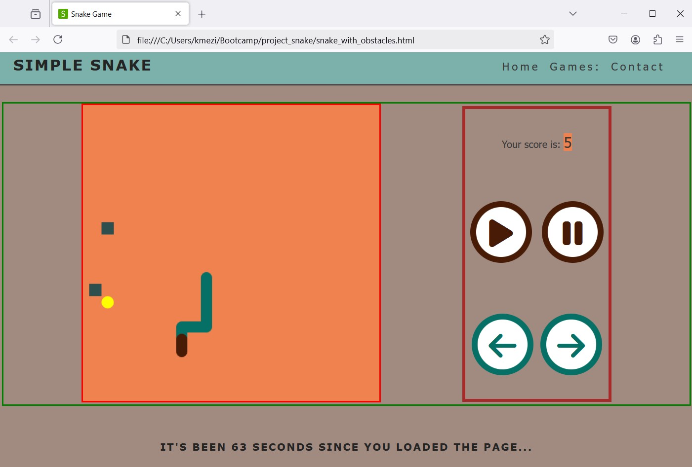
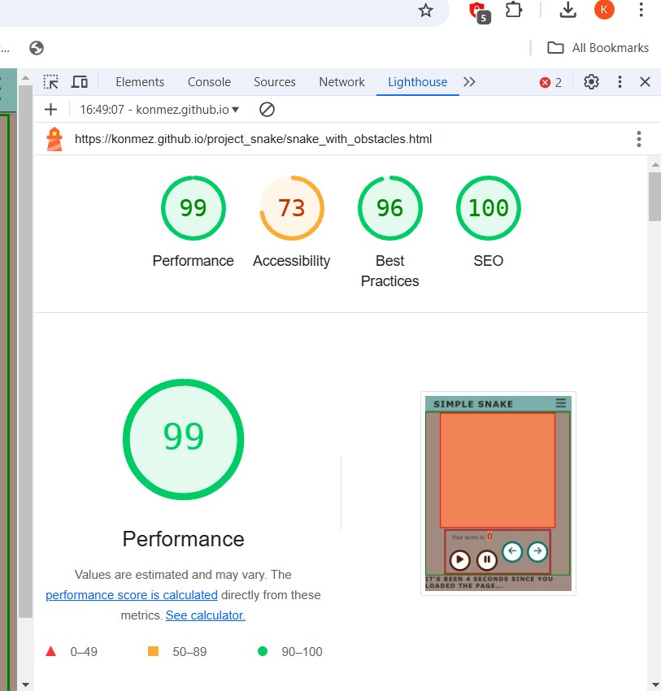

# Browser Snake Game 🐍


## Description
A classic Snake game built with vanilla JavaScript, HTML, and CSS. Control a snake as it moves around the game board, eat food to grow longer, and avoid hitting the walls or yourself! Features include responsive controls, sound effects, and a restart option.

## Features
- Smooth snake movement with keyboard controls
- Responsive design that works on all modern browsers
- Sound effects for eating food, game over, and background music
- Score tracking 
- Restart game functionality
- Pause/Resume game option
- Mobile-friendly touch controls
- Colorful retro-style graphics

## Technologies Used
- HTML5
- CSS3
- Vanilla JavaScript


## How to Play
1. Open `index.html` in your web browser, navigate to snakesimple
2. Press 'play' or R to start the game
3. Use arrow keys or WASD to control the snake:
   - ↑ or W: Move Up
   - ↓ or S: Move Down
   - → or D: Move Right
   - ← or A: Move Left
4. Press SPACE to pause/resume the game
5. Press R to restart after game over

## Installation
1. Clone the repository:
```bash
git clone https://github.com/konmez/project_snake.git
```

2. Navigate to the project directory:


3. Open index.html in your preferred browser or use a local server:


## Project Structure
```
snake-game/
│
├── index.html                         # Main HTML file
├── snake_simple.html                  # simplest snake 
├── snake_with_obstacles.html          #snake with generated obstacles and less control buttons
├── contact.html                       # contact page
|
├── css/
│   ├── index_style/           # main page style
|   ├── contact_style/         #contact page style
|   ├── snake_simple_style/    #game page style
|   ├── snake_obstacles_style/ #anothe snake game styles
|
├── js/          # Game logic
│               # Input handling
│               # Sound management
└── assets/
    ├── audio/        # Game sound effects
    └── images/        # Game graphics
```

## Game Mechanics
- Snake grows longer when eating food
- Game ends if snake hits the wall or itself
- Score increases with each food item eaten


## Browser Compatibility
- Chrome (recommended)
- Firefox
- Safari
- Edge
- Opera

## Contributing
1. Fork the repository
2. Create your feature branch (`git checkout -b feature/AmazingFeature`)
3. Commit your changes (`git commit -m 'Add some AmazingFeature'`)
4. Push to the branch (`git push origin feature/AmazingFeature`)
5. Open a Pull Request

## Known Issues
- Sound may not work on some mobile browsers
- Touch controls might need calibration on certain devices

## Future Enhancements
- Speed gradually increases as score gets higher
- High score is saved in local storage
- Multiple difficulty levels
- Different snake skins
- Power-ups and obstacles
- Multiplayer mode
- Leaderboard system

## License
This project is licensed under the MIT License - see the [LICENSE](LICENSE) file for details.

## Credits
- Sound effects from (https://https://mixkit.co/)
- Inspired by the classic Nokia Snake game
- Used some code& design ideas  as template from Code Institute 'LoveRuning & LoveMath' projects
- Used some ideas and information from Stack Overflow & W3school 
      aswell from R.Nixons book 'Learning PHP MySQL & Javascript'


## Contact
- Kon mez (mailto:kmezin@yahoo.om)
- Project Link: [https://konmez.github.io/project_snake/]


To check my project, please, click <a href="https://konmez.github.io/project_snake/" target="_blank">this link.</a>

Snippet from game :
.
Snippet about perfomance :

